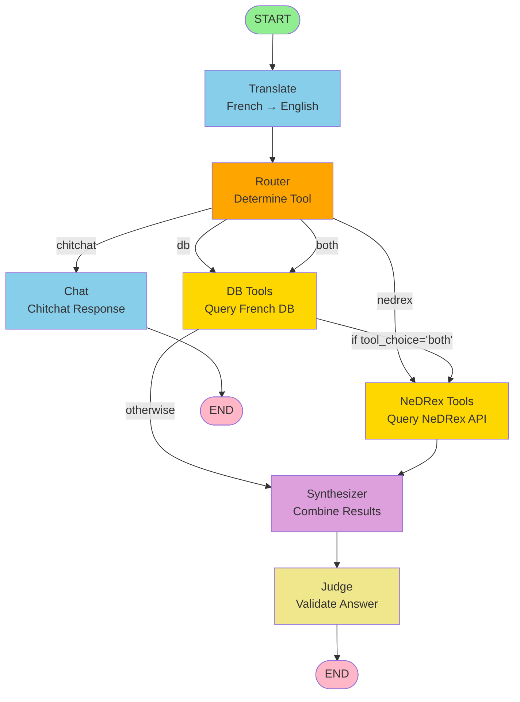

# Medical RAG Graph Workflow

```mermaid
graph TD
    START([START])
    TRANSLATE["Translate<br/>French → English"]
    ROUTER["Router<br/>Determine Tool"]
    DB_TOOLS["DB Tools<br/>Query French DB"]
    NEDREX_TOOLS["NeDRex Tools<br/>Query NeDRex API"]
    SYNTHESIZE["Synthesizer<br/>Combine Results"]
    JUDGE["Judge<br/>Validate Answer"]
    CHAT["Chat<br/>Chitchat Response"]
    END_DB([END])
    END_CHAT([END])
    
    START --> TRANSLATE
    TRANSLATE --> ROUTER
    
    ROUTER -->|db| DB_TOOLS
    ROUTER -->|nedrex| NEDREX_TOOLS
    ROUTER -->|both| DB_TOOLS
    ROUTER -->|chitchat| CHAT
    
    DB_TOOLS -->|if tool_choice='both'| NEDREX_TOOLS
    DB_TOOLS -->|otherwise| SYNTHESIZE
    
    NEDREX_TOOLS --> SYNTHESIZE
    
    SYNTHESIZE --> JUDGE
    JUDGE --> END_DB
    
    CHAT --> END_CHAT
    
    style START fill:#90EE90
    style END_DB fill:#FFB6C6
    style END_CHAT fill:#FFB6C6
    style CHAT fill:#87CEEB
    style DB_TOOLS fill:#FFD700
    style NEDREX_TOOLS fill:#FFD700
    style SYNTHESIZE fill:#DDA0DD
    style JUDGE fill:#F0E68C
    style ROUTER fill:#FFA500
    style TRANSLATE fill:#87CEEB

```
